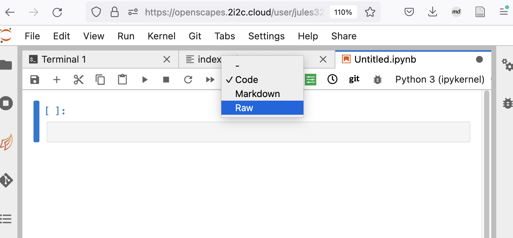

Your Jupyter setup will involve `.ipynb` notebooks and the command line. You can interact with Quarto through JupyterLab or JupyterHub. [Quarto's JupyterLab tutorials](https://quarto.org/docs/get-started/hello/jupyter.html) has great instructions on getting started with JupyterLab, including computations and authoring.

Here we will demonstrate how to add a Jupyter Notebook (`.ipynb` file) to your tutorial site. This example uses the NASA-Openscapes JupyterHub that already has all python environments as well as Quarto installed.

## Setup JupyterHub

Our JupyterHub is already setup with python environments as well as Quarto (through [nasa-openscapes/corn](https://github.com/nasa-openscapes/corn)), so there is no further installation required.

### Clone your repo

You'll start by cloning your repository into JupyterHub. Do this by opening a terminal (File \> New \> Terminal). In the Terminal, `git clone` your repository and `cd` into it:

``` bash
git clone https://github.com/openscapes/quarto-website-tutorial
cd quarto-website-tutorial
```

## Quarto preview

Let's start off by previewing our quarto site locally. In Terminal, type `quarto preview`, which will provide a URL with a preview of our site!

``` bash
quarto preview
# Preparing to preview
# Watching files for changes
# Browse at https://openscapes.2i2c.cloud/user/jules32/proxy/4593/
```

Copy this URL into another browser window; and arrange them so you can see them both. I make a bit more space in Jupyter by collapsing the left file menu by clicking on the file icon at the top of the left sidebar.

{fig-align="center"}

Now we'll be able to see live changes in the preview as we edit in our `.md` files. Let's try it: Change the date in `index.md` by opening it from the file directory. Change to today's date, and save. Your preview window will refresh automatically! If it does not, you can also refresh the page manually. The refreshed previewed site will now display your changes!

## Create a new `.ipynb` page

Let's add a new page to our site. Instead of an `.md` file like the others, let's add a `.ipynb` file.

File \> New \> Notebook. Accept the default kernel by clicking Select.

### First chunk: raw yaml

By default, this Notebook will give us a first chunk that is code. Let's change it to raw so that we can write our yaml at the top.

{fig-align="center"}

In our Raw code chunk, let's write the title of this document. We need three dashes `---` on separate lines preceding and following the `title:`, which you can name as you'd like.

``` bash
---
title: Python Example
---
```

### Second chunk: Markdown

Let's add a new chunk that is Markdown so we can write some description of what this page will be.

Click the `+` symbol at the top of the document, and this will add a new chunk, which by default again is a Code chunk. Change it to a Markdown Chunk following the steps we did above when switching to Raw.

Here, write a little bit of text in Markdown. Since your title is effectively a level-1 header, avoid using level-1 headers in the rest of your document. Here is some example text I wrote:

    ## Introduction

    This example has some Python code that will be a part of our Quarto site.

### Third chunk: Code

Now let's create a new chunk with the default Code setting.

Paste the following code (or write some of your own to test):

``` python
#| label: fig-polar
#| fig-cap: "A line plot on a polar axis"
import numpy as np
import matplotlib.pyplot as plt
r = np.arange(0, 2, 0.01)
theta = 2 * np.pi * r
fig, ax = plt.subplots(
  subplot_kw = {'projection': 'polar'} 
)
ax.plot(theta, r)
ax.set_rticks([0.5, 1, 1.5, 2])
ax.grid(True)
plt.show()
```

### Save your file

Save your document - I'll call mine `python-example.ipynb` in the main repository.

## Update `_quarto.yml`

Now we'll add `python-example.ipynb` to our `_quarto.yml` file; this is where we register of all files to include in our site. Let's add it after the section called "Basic Workflows".

Open `_quarto.yml` by clicking on it from the file directory.

Scroll down to review the current contents in the `sidebar:` section. It's there we see all the file arrangement that we see in the previewed site.

Add `- python-example.ipynb` to line 46, making sure that your indentation aligns with the other pages.

{fig-align="center"}

## Authoring

For specific instructions about authoring in Quarto with Jupyter, see [https://quarto.org/docs/reference/cells/cells-jupyter](https://quarto.org/docs/reference/cells/cells-jupyter.html).

## Troubleshooting

### My changes don't show up in preview

Make sure you've saved your file! There might be a slight delay depending on your JupyterHub/Lab setup.

### Quarto render hangs / does not complete

Check the specific notebook, are there any \`---\` throughout to denote linebreaks rather than yaml? Delete those.

Also check how long the first raw cell is. Are there level-1 headers (`#`)? Try removing them.

## 
